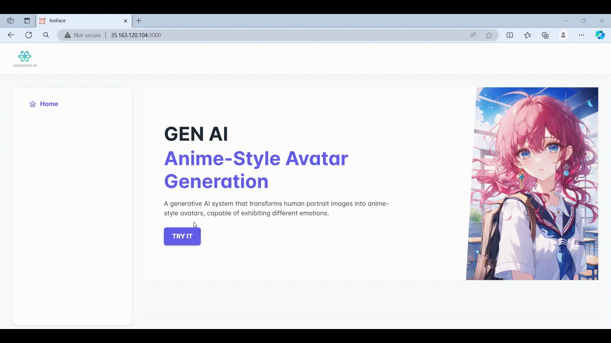

# AniFace

This project is a part of the Cinnamon 2024 Bootcamp.

Create your own anime-style avatars with different assets of your choice.

### Contributors
|            Name               | Profile
|----------------|-------------------------------
|Đỗ Nguyễn Duy Hoàng | [@hoang1645](https://github.com/hoang1645)
|Từ Lễ Huy | [@21522173huy](https://github.com/Jay-Huy)
|Nguyễn Hải Nam | [@NamSee04](https://github.com/NamSee04)
|Mai Anh Quan | [@Qcymaq](https://github.com/Qcymaq)

## Overview
We use [Animagine-XL 3.0](https://huggingface.co/Linaqruf/animagine-xl-3.0), which is a diffusion model fine-tuned from Stable Diffusion XL, to generate anime-style portrait images from human faces as the backbone.

The application uses FastAPI as the backend, NodeJS as frontend.

## Fine-tuning
We crawled and filtered out more than 20k images from Pixiv, which were then face-cropped followed by a bunch of other post-processing stuff. Details will be in our report.

For model fine-tuning, we use LoRA as our method of parameter-efficient finetuning (PEFT) method. The model was fine-tuned for 10 epochs.

## Use the app
### Environment setup
- Backend: We have tested on these versions of Python:
    - 3.10
    - 3.11 (main)

  3.12 should also work, if there are no unsupported packages.
- Frontend: NodeJS version 18+ (wink wink nudge nudge) should work.
- Hardware:
  - Minimum requirements: 16GB RAM + NVIDIA GPU with 16 GB VRAM (we tested on NVIDIA Tesla T4).
  - Recommended: 32GB RAM + NVIDIA GPU with 24+ GB VRAM.

### Install dependencies
- Python: just do regular `pip install -r requirements.txt`.
- NodeJS: Install the `next` library in the frontend directory.
```bash
cd frontend
npm install next
```
- Model checkpoint: download [this](https://drive.google.com/file/d/17xve1HRBAiDACOviOmGQbFNE8u2z4ZVi/view?usp=drive_link) and save it at `backend/checkpoints`.
### RUN!
- To run backend:
```bash
cd backend
fastapi run app.py
```
- To run frontend:
```bash
cd frontend
npm run dev
```
The backend uses port 8000 (and 3000 for frontend) so make sure you have those ports vacant before running.

Check the app at http://localhost:3000.

### Use with Docker
We have provided a front-to-back Dockerfile for your container needs. Just do 4 simple steps:
- Install the NVIDIA Container Toolkit
- Run `docker build . -t wukong-avatar-creator`
- Run `docker run --gpus=all -p 3000:3000 -p 8000:8000 wukong-avatar-creator`
- Check the web app at `https://localhost:3000`

## Fine-tune the model yourself?
We have provided the training script and configuration at `backend/src`. Modify anything you need to and run
```bash
cd backend/src
python train.py
```

## Demo

**Step 1:** Upload your face image:


**Step 2:** Select your options:


**Step 3:** Wait for processing and view your results:


## Future works
As this is a fine-tuned SDXL, and we used the raw implementation of Hugging Face `diffusers`, image-to-image tasks are gonna be slow (~19s on T4 with strength 6.0-8.5, which covers the range of strengths we use in the app). If we can find the time, here is what we want to do to speed up the app:

- [ ] Use `torch.compile`
- [ ] Use `tensorrt`
- [ ] Switch the VAE (`AutoencoderKL`) to its distilled version [taesd](https://github.com/madebyollin/taesd).
